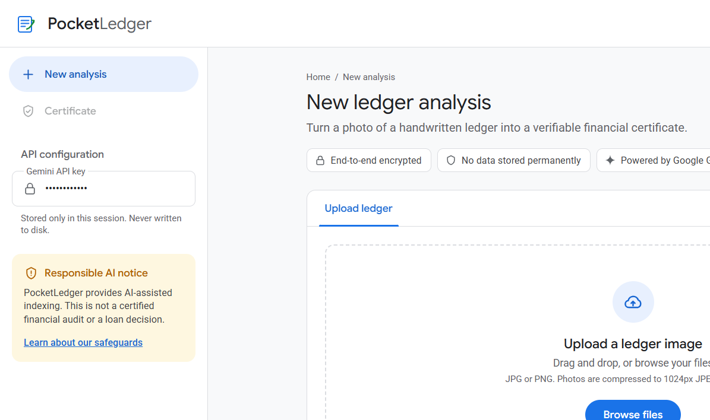
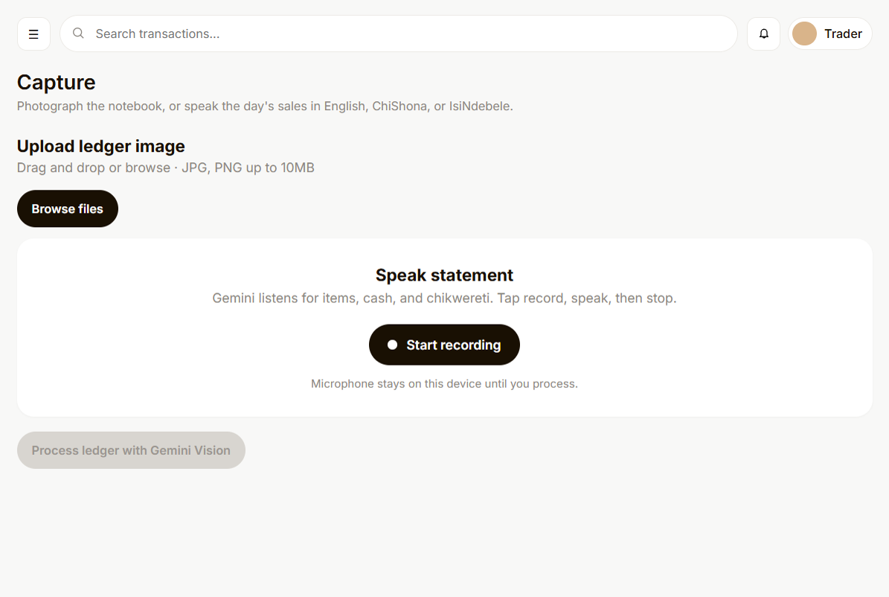
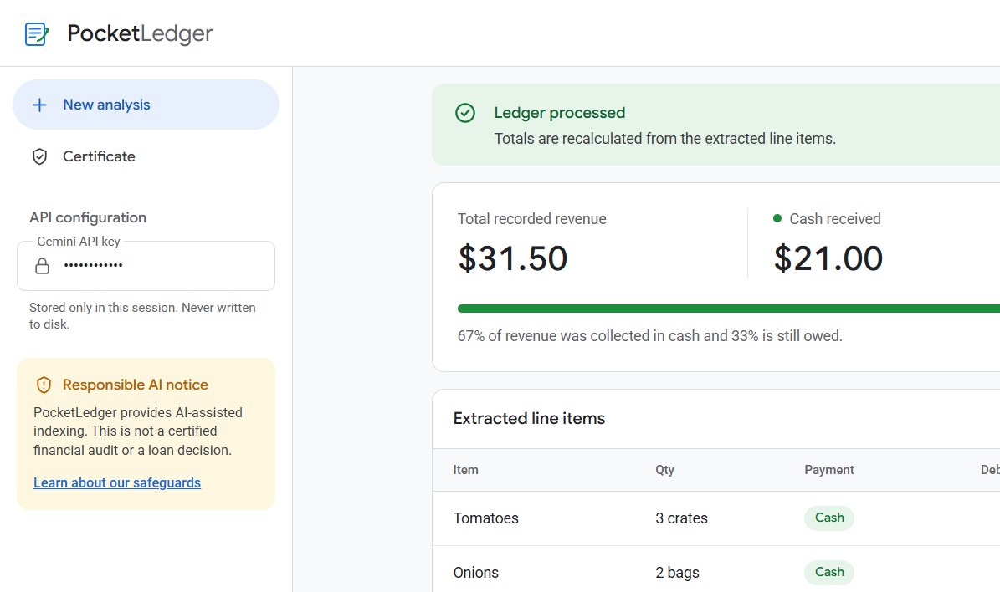
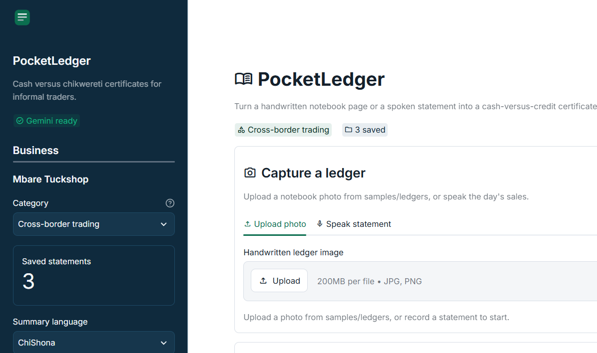

# PocketLedger — AI financial certificate for informal traders

Built for **Hack for Humanity Harare 2026** (challenge: Best Use of the Google Gemini API).

Informal traders keep daily sales and *chikwereti* (customer credit) in paper notebooks. That makes it hard to prove cash flow for a micro-loan. PocketLedger uses Gemini Vision (`gemini-3.6-flash`) to read a handwritten page or a spoken statement, split cash versus credit, and produce a structured micro-business financial health certificate.

## Demo

[Live UI on GitHub Pages](https://fabber04.github.io/czi-hackathon/) — PocketLedger dashboard (Overview, Capture, Transactions, Certificate). Live Gemini extraction runs locally with `python preview_server.py` or `streamlit run app.py`.

**1. Capture.** Photograph a notebook page or dictate the day’s sales in English, ChiShona, or IsiNdebele.

**2. Extract.** Gemini returns JSON line items. The app recalculates revenue, cash, outstanding credit, and expenses (rent is not counted as sales).

**3. Certificate.** The Streamlit app keeps a trader profile, language toggle, and a simple 7-day projection from saved pages.

Sample notebook images for the demo live in `samples/ledgers/`.

## Gemini integration and tech stack

- **Multimodal vision and audio:** Reads non-standard notebook layouts and spoken market language.
- **Structured outputs:** Converts the page or recording into JSON the app can verify, display, and export as PDF.
- **Stack:** Python, Streamlit, `google-genai` SDK, Pandas, Pillow, fpdf2.

## Run locally

1. `python -m venv .venv`
2. `.venv\Scripts\activate`
3. `pip install -r requirements.txt`
4. Copy `.env.example` to `.env` and add `GEMINI_API_KEY`
5. `streamlit run app.py`

Optional HTML preview with the extract API: `python preview_server.py` then open [http://127.0.0.1:8765/](http://127.0.0.1:8765/).

## Safeguards and limitations

PocketLedger is AI-assisted indexing for micro-finance evaluation. It is not an IT audit, tax audit, or certified financial report, and it is not a loan decision. Images and recordings are processed in the session and are not stored permanently.

## Hack Day build boundary

**Built today:** Streamlit UI, Gemini Vision and audio prompts, JSON parser, cash-versus-credit dashboard, 503 handling, PDF certificate, and a demo sample ledger generator.
